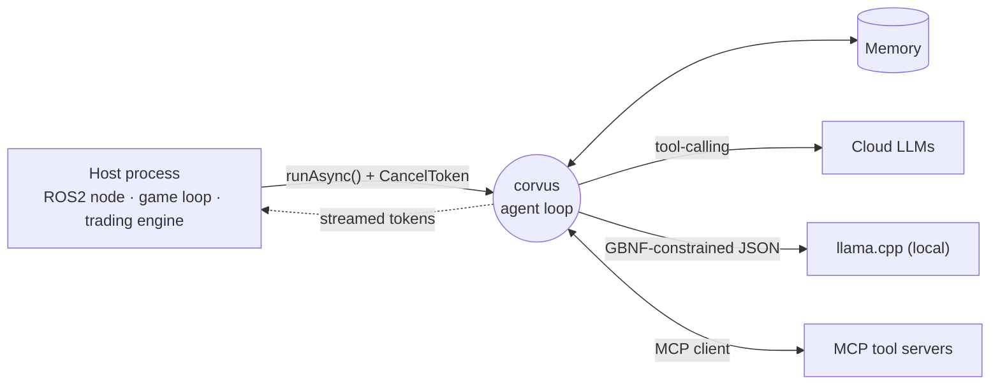

<div align="center">

<!-- ══════════════════════ HEADER ══════════════════════ -->


<a href="https://github.com/Ambar-Gupta22/corvus">
  
</a>

<p>
  <a href="https://linkedin.com/in/ambar-gupta"></a>
  <a href="https://leetcode.com/u/Ambar_Gupta"></a>
  <a href="mailto:gvansh2211@gmail.com"></a>
  
</p>

<!-- ══════════════════════ TERMINAL (live, regenerated every 6h) ══════════════════════ -->
<a href="https://github.com/Ambar-Gupta22/corvus">
  
</a>

</div>

<!-- ══════════════════════ ABOUT ══════════════════════ -->
## 🧭 About Me

```cpp
struct Engineer {
    std::string_view name     = "Ambar Gupta";
    std::string_view role     = "Software Development Engineer @ ICICI";
    std::string_view building = "corvus — in-process AI agent runtime for C++17";
    std::array<std::string_view, 4> focus = {
        "distributed backends", "low-latency systems", "LLM agents / MCP", "fintech at scale"};
    std::string_view edu      = "B.Tech ECE, NIT Surat (SVNIT) '26";
    std::string_view dsa      = "1000+ LeetCode · 1800 contest rating · top 8% globally";

    [[nodiscard]] bool open_to(std::string_view what) const noexcept {
        return what == "systems collabs" || what == "OSS contributions" || what == "hard problems";
    }
};
```

- 💼 **SDE @ ICICI** — backend engineering for banking &amp; fintech at scale
- 🔭 Building **[corvus](https://github.com/Ambar-Gupta22/corvus)** — an offline-capable AI agent runtime for **C++17** that runs where Python can't: ROS2 nodes, game threads, drones, trading loops
- ⚙️ Distributed backends: event-driven microservices, durable queues, real-time observability — built an **8-service** fault-tolerant system from scratch
- 🧑‍💻 Previously: Full-Stack Engineering Intern @ **Dukanify** — multi-tenant SaaS edge routing, atomic billing, zero-downtime HTTPS automation
- 📫 **gvansh2211@gmail.com** — happy to talk systems, C++, or agents

<!-- ══════════════════════ FLAGSHIP ══════════════════════ -->
## 🐦‍⬛ Flagship Project — corvus

<div align="center">
  <a href="https://github.com/Ambar-Gupta22/corvus">
    
  </a>
</div>

> **An AI agent runtime for native C++ — think LangChain, but it runs where Python can't.**
> Local-first · embeddable · MCP-native.

- 🔌 **MCP-native client** — plugs into thousands of existing MCP tool servers on day one
- ⚡ **Native tool-calling + GBNF** — provider tool-use for cloud models, grammar-constrained JSON for local llama.cpp
- 🧵 **Async + streaming + cancellation** — non-blocking `runAsync()` with `CancelToken`, safe inside ROS2 nodes, game loops, and HFT paths
- ✅ **Offline, deterministic test suite** — 23 test cases / 76 assertions, 3-OS CI matrix with ASan/UBSan/TSan



## 🧪 More Things I've Built

| Project | What it is | Stack |
|---|---|---|
| **[social-media-microservices-backend](https://github.com/Ambar-Gupta22/social-media-microservices-backend)** | Distributed social backend — event-driven services over RabbitMQ, WebSocket messaging, containerised | Node · RabbitMQ · Redis · Docker |
| **[paylite](https://github.com/Ambar-Gupta22/paylite)** | UPI-style person-to-person payments with QR scan-and-pay | Dart · Flutter |
| **[E-Commerce](https://github.com/Ambar-Gupta22/E-Commerce)** | Full-stack store — JWT auth, Stripe payments, Redis caching, admin dashboard | MERN · Stripe · Redis |
| **[Streamify](https://github.com/Ambar-Gupta22/Streamify)** | Language-exchange platform with real-time chat and video calling | MERN · real-time video |

<!-- ══════════════════════ TECH STACK ══════════════════════ -->
## 🛠️ Tech Stack

<div align="center">

**Languages & Systems**<br/>


**Backend & Data**<br/>


**Infra & Observability**<br/>


**Frontend & Mobile**<br/>


</div>

<!-- ══════════════════════ GITHUB ANALYTICS (self-hosted, see scripts/generate.mjs) ══════════════════════ -->
## 📊 GitHub Analytics

<div align="center">


<sub>⚙️ All cards are generated by <a href="scripts/generate.mjs">my own zero-dependency script</a> from the GitHub GraphQL API and refreshed every 6 hours by <a href=".github/workflows/profile.yml">GitHub Actions</a> — no third-party stats servers.</sub>

</div>

<!-- ══════════════════════ LEETCODE ══════════════════════ -->
## 🧠 Problem Solving

<div align="center">

<a href="https://leetcode.com/u/Ambar_Gupta">
  
</a>

<br/><br/>


</div>

<!-- ══════════════════════ SNAKE ══════════════════════ -->
<div align="center">
<br/>

<picture>
  <source media="(prefers-color-scheme: dark)" srcset="https://raw.githubusercontent.com/Ambar-Gupta22/Ambar-Gupta22/output/github-snake-dark.svg" />
  <source media="(prefers-color-scheme: light)" srcset="https://raw.githubusercontent.com/Ambar-Gupta22/Ambar-Gupta22/output/github-snake.svg" />
  
</picture>


</div>
